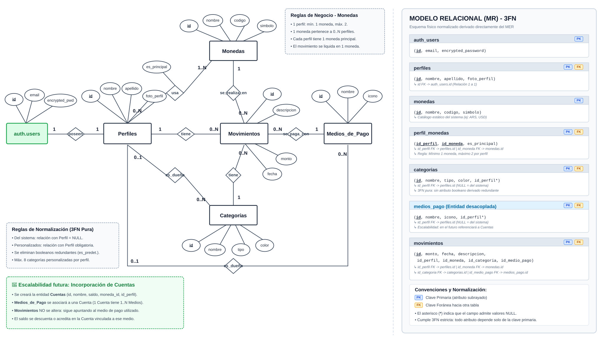

# PROYECTO INTEGRADOR — METODOLOGÍA DE SISTEMAS II

# Finzo: Sistema web de gestión de finanzas personales

**Documento actualizado:** 05/10/2026  
**Versión:** 7.0  
**Equipo:** Federico Heinrich, Valentina Vitale, Alesio Cragno, Maximo Messina.

---

**Propósito del documento:** Presentar la propuesta al grupo y servir como guía o mapa para diseñar, desarrollar, probar y defender el proyecto.

---

## 1. Resumen

**Finzo** será una aplicación web para registrar, organizar y analizar finanzas personales. Permitirá registrar ingresos, gastos, categorías y preferencias básicas, además de consultar el saldo y un resumen mensual.

El problema que busca resolver es cotidiano: muchas personas conocen su saldo, pero no identifican con claridad cuánto gastan, en qué categorías ni cómo cambia su situación financiera con el tiempo. Finzo busca centralizar esa información y convertirla en información útil para tomar decisiones.

> **Criterio principal:** priorizar un producto funcional, seguro, escalable y defendible antes que una gran cantidad de funcionalidades.

---

## 2. Objetivo, usuarios y preguntas que debe responder

### Objetivo general

Diseñar e implementar un sistema web seguro y mantenible que centralice la información económica del usuario y le brinde visibilidad clara sobre su balance cotidiano y hábitos de consumo.

### Usuario objetivo

Personas que buscan controlar sus finanzas cotidianas sin utilizar una herramienta contable compleja ni conectar cuentas bancarias reales.

### Preguntas principales

- ¿Cuánto dinero gasté este mes?
- ¿En que categoria gasto más?
- ¿Cuanto dinero me ingresó este mes?
- ¿Cuanto me queda disponible?
- ¿Cómo se distribuyen mis gastos?
- En una fase posterior, ¿cómo evolucionó mi balance respecto a otros periodos?

### Objetivos académicos y técnicos

- Diseñar una solución con responsabilidades claras.
- Construir un MVP funcional y reproducible.
- Trabajar de forma colaborativa mediante ramas, issues y pull requests.
- Aplicar patrones y principios solo cuando resuelvan problemas concretos.
- Incorporar tests, refactoring, documentación y automatización durante el desarrollo.
- Registrar las decisiones relevantes para poder justificarlas en la defensa.

---

## 3. Alcance y prioridades

### 3.1 MVP obligatorio

#### Autenticación y perfil

- Registro, inicio y cierre de sesión.
- Privacidad y aislamiento de datos: cada usuario solo puede consultar y gestionar su propia información financiera (movimientos, categorías y configuraciones), sin acceso a los datos de otros usuarios.
- Consulta y edición de nombre, apellido, correo, contraseña, monedas y moneda principal.

#### Movimientos

- Crear, editar, eliminar y consultar ingresos y gastos.
- Informar monto, categoría, descripción, fecha y medio de pago. El tipo de movimiento (ingreso o gasto) se determina automáticamente por la categoría seleccionada.
- Filtrar por fecha, categoría, tipo de movimiento y medio de pago.

#### Categorías

- Consultar categorías de ingreso y gasto.
- Crear, editar y eliminar categorías personalizadas.

#### Dashboard

- Total de ingresos del mes actual.
- Total de gastos del mes actual.
- Balance neto del mes actual (ingresos menos gastos).
- Listado de movimientos recientes con detalle básico (fecha, categoría, monto y tipo).

### 3.2 Funcionalidades posteriores al MVP

Se incorporarán únicamente si la base está estable y cumple la definición de terminado.

**Prioridad 2: Página de Estadisticas y Análisis**

- Distribución de los gastos por categoría mediante gráficos.
- Evolución mensual de ingresos, gastos y balance.
- Comparación de los resultados con el periodo anterior.
- Indicadores de tasa de ahorro, promedio de gastos y categoría con mayor consumo.

**Prioridad 3: Planificación financiera**

- Presupuestos por categoría.
- Metas de ahorro.
- Movimientos recurrentes.

**Prioridad 4: Mejoras complementarias**

- Importación y exportación CSV.
- Analisis de IA sobre el flujo de caja y generacion de un consejo adecuado al caso.
- Modo oscuro.

---

## 4. Requisitos funcionales y reglas de negocio

### RF-01 Autenticación

El sistema permitirá registrar usuarios, iniciar sesión, cerrar sesión y mantener una sesión válida.

### RF-02 Perfil

El usuario podrá consultar y modificar todos sus datos personales (nombre, apellido, correo electrónico y contraseña), así como sus monedas y la selección de su moneda principal.

### RF-03 Gestión de movimientos

El usuario podrá crear, consultar, editar y eliminar movimientos propios.

### RF-04 Gestión de categorías

El usuario podrá utilizar categorías iniciales y administrar categorías personalizadas separadas por tipo: ingreso o gasto.

### RF-04b Gestión de medios de pago

El usuario podrá utilizar medios de pago predeterminados del sistema y administrar medios de pago personalizados.

### RF-05 Consulta y filtros

El historial permitirá filtrar movimientos por descripción, periodo(mes/año), categoria, tipo de movimiento (Ingreso/gasto) y medio de pago.

### RF-06 Resumen financiero

El dashboard calculará los ingresos, gastos y el balance del mes actual. En el MVP no habrá selector de períodos; la consulta de otros intervalos quedará disponible mediante los filtros del historial.

### Reglas de negocio iniciales

- El monto debe ser mayor que cero.
- El tipo de movimiento se determina por la categoría asociada: cada categoría es de tipo `ingreso` o `gasto`.
- El medio de pago debe existir y ser accesible para el usuario (predeterminado del sistema o personalizado propio).
- La categoría debe existir, corresponder al usuario y ser compatible con el tipo de movimiento.
- La fecha debe tener un formato válido.
- Un usuario solo podrá consultar o modificar sus propios datos.
- El balance se calculará como ingresos menos gastos.
- Las eliminaciones y ediciones deberán actualizar los resúmenes mostrados.
- Las validaciones críticas se ejecutarán en el backend; el frontend validará también para mejorar la experiencia.

---

## 4. Arquitectura propuesta

```text
┌────────────────────────────────────────┐
│ Frontend (Vercel)                      │
│ React + TypeScript + Vite + Tailwind   │
└──────────────────┬─────────────────────┘
                   │ HTTP / REST (JSON + JWT)
                   ▼
┌────────────────────────────────────────┐
│ Backend API (Render)                   │
│ Node.js + TypeScript + Express         │
└──────────────────┬─────────────────────┘
                   │ Prisma ORM (TCP / SSL)
                   │ Supabase Auth SDK
                   ▼
┌────────────────────────────────────────┐
│ Base de Datos & Auth (Supabase)        │
│ PostgreSQL + Auth Service              │
└────────────────────────────────────────┘
```

### Estructura definida

```text
finzo/
├── backend/
│   ├── prisma/                 # Esquema de Prisma (schema.prisma), migraciones y seeds
│   ├── src/
│   │   ├── config/             # Configuración de entorno y clientes externos
│   │   ├── controllers/        # Controladores que reciben peticiones HTTP
│   │   ├── middlewares/        # Middlewares de autenticación, validación y error
│   │   ├── models/             # Interfaces y modelos de dominio
│   │   ├── repositories/       # Abstracción y acceso a la base de datos
│   │   ├── routes/             # Definición de endpoints REST
│   │   ├── services/           # Lógica y reglas de negocio del sistema
│   │   ├── types/              # Declaraciones de tipos TypeScript y DTOs
│   │   ├── utils/              # Funciones auxiliares de cálculo y formato
│   │   ├── app.ts              # Configuración de la aplicación Express
│   │   └── server.ts           # Punto de entrada y levantamiento del servidor
│   ├── tests/                  # Tests unitarios y de integración (Vitest)
│   ├── .env.example            # Plantilla de variables de entorno para backend
│   ├── package.json            # Dependencias y scripts del backend
│   ├── prisma.config.ts        # Configuración de Prisma
│   ├── tsconfig.json           # Configuración de TypeScript
│   └── vitest.config.ts        # Configuración de Vitest para backend
│
├── frontend/
│   ├── public/                 # Archivos estáticos públicos (logos, favicons)
│   ├── src/
│   │   ├── components/         # Componentes reutilizables (UI, layout, dashboard)
│   │   ├── context/            # Contextos globales de React (AuthContext)
│   │   ├── hooks/              # Custom hooks para lógica desacoplada
│   │   ├── pages/              # Vistas principales (Dashboard, Movimientos, Login)
│   │   ├── routes/             # Enrutamiento de la aplicación (protegidas/públicas)
│   │   ├── services/           # Clientes HTTP y llamadas al backend
│   │   ├── styles/             # Estilos globales y configuración de estilos
│   │   ├── types/              # Tipos compartidos en la interfaz
│   │   ├── utils/              # Funciones auxiliares de formato y fechas
│   │   ├── App.tsx             # Componente raíz de React
│   │   ├── main.tsx            # Punto de montaje en el DOM
│   │   └── vite-env.d.ts       # Declaraciones de tipos de variables de entorno Vite
│   │
│   ├── index.html              # Punto de entrada HTML de Vite
│   ├── .env.example            # Plantilla de variables de entorno para frontend
│   ├── package.json            # Dependencias y scripts del frontend
│   ├── tsconfig.json           # Configuración de TypeScript
│   ├── vite.config.ts          # Configuración del bundler Vite
│   └── vitest.config.ts        # Configuración de pruebas para frontend
│
├── docs/                       # Documentación complementaria (API, diagramas)
│   └── API.md
├── .github/                    # Automatización e integración continua
│   └── workflows/              # GitHub Actions para CI/CD
├── .gitignore                  # Reglas de exclusión de Git
├── .nvmrc                      # Versión de Node.js requerida
├── .prettierrc                 # Configuración de formato de código (Prettier)
├── eslint.config.js            # Configuración de linter (ESLint Flat Config)
├── pnpm-workspace.yaml         # Configuración del monorepo con pnpm
├── package.json                # Configuración raíz del monorepo
├── LICENSE                     # Licencia del proyecto
├── PROPUESTA.md                # Documento completo de la propuesta académica
└── README.md                   # Documentación principal del proyecto
```

Esta estructura es una guía inicial. Podrá cambiar mediante una decisión documentada si el equipo detecta una alternativa más simple o adecuada.

---

## 5. Tecnologías y criterio de elección

| Área                | Propuesta                             | Uso principal                                                                        |
| ------------------- | ------------------------------------- | ------------------------------------------------------------------------------------ |
| Frontend            | React, TypeScript, Vite, Tailwind CSS | Interfaz, formularios y navegación                                                   |
| Backend             | Node.js, TypeScript, Express          | API REST y reglas de negocio                                                         |
| Datos               | Supabase con PostgreSQL y Prisma ORM  | Persistencia administrada y mapeo tipado de datos                                    |
| Autenticación       | Supabase Auth                         | Usuarios y sesiones                                                                  |
| Testing             | Vitest y Testing Library              | Vitest para tests unitarios, de servicios y de API; Testing Library para componentes |
| Automatización      | GitHub Actions                        | Lint, typecheck y tests                                                              |
| Versionado          | Git y GitHub                          | Código, issues y pull requests                                                       |
| Seguimiento         | Jira                                  | Backlog, responsables y estados                                                      |
| Frontend desplegado | Vercel                                | Publicación del cliente web                                                          |
| Backend desplegado  | Render                                | Publicación de la API Node.js y Express                                              |

### Decisiones cerradas en Taller I

- El repositorio utilizará `pnpm` como gestor de paquetes. El archivo `.nvmrc` indicará la versión de Node.js compatible con el proyecto; el README documentará cómo activarla con `nvm use` antes de instalar las dependencias.
- El backend se implementará con Node.js y Express y se desplegará en Render.
- Supabase se utilizará para autenticación y base de datos PostgreSQL; Prisma se utilizará como ORM para el modelado de datos, migraciones y consultas tipadas.
- Vitest será la herramienta común para ejecutar los tests unitarios, de servicios y de API; Testing Library se utilizará para los tests de componentes.
- Estrategia de borrado de categorías asociadas a movimientos.
- Una moneda principal obligatoria y hasta una secundaria opcional por perfil (máximo 2, ej. ARS y USD), manejando todos los importes con tipo decimal de dos posiciones para garantizar precisión financiera y evitar errores de redondeo.
- Normalización del medio de pago como entidad independiente (`medios_pago`) para cumplir 3FN y habilitar personalización por usuario.
- Eliminación del campo `tipo` en movimientos: se infiere de la categoría asociada.
- Eliminación del campo `es_predeterminada` en categorías: se infiere de `id_perfil IS NULL` (3FN).

---

## 6. Modelo inicial de datos



### `monedas`

- `id`
- `nombre` (ej: Peso Argentino, Dólar Estadounidense)
- `codigo` (ej: ARS, USD)
- `simbolo` (ej: $, U$S)

### `perfiles`

- `id` (referencia 1 a 1 a `auth.users.id` de Supabase — funciona como PK y FK simultáneamente)
- `nombre`
- `apellido`
- `foto_perfil` (URL o path del avatar)
- `created_at`
- `updated_at`

### `perfil_monedas`

- `id_perfil` (FK a `perfiles`, parte de PK compuesta)
- `id_moneda` (FK a `monedas`, parte de PK compuesta)
- `es_principal` (booleano: indica la moneda por defecto del dashboard)

### `categorias`

- `id`
- `id_perfil` (FK nullable: NULL para categorías del sistema)
- `nombre`
- `tipo` (`ingreso` o `gasto`)
- `color` (identificador o código de color para UI)
- `created_at`
- `updated_at`

### `medios_pago`

- `id`
- `id_perfil` (FK nullable: NULL para medios de pago del sistema)
- `nombre` (ej: Efectivo, Débito, Crédito, Transferencia)
- `icono` (identificador de icono para UI)
- `created_at`
- `updated_at`

### `movimientos`

- `id`
- `id_perfil` (FK a `perfiles`)
- `id_categoria` (FK a `categorias`)
- `id_moneda` (FK a `monedas`)
- `id_medio_pago` (FK a `medios_pago`)
- `monto` (tipo Decimal con precisión de dos decimales)
- `descripcion`
- `fecha`
- `created_at`
- `updated_at`

### Relaciones

```text
auth.users 1 ─── 1 perfiles
perfiles 1 ─── M perfil_monedas
monedas 1 ─── M perfil_monedas
perfiles 0..1 ─── M categorias
perfiles 0..1 ─── M medios_pago
perfiles 1 ─── M movimientos
categorias 1 ─── M movimientos
monedas 1 ─── M movimientos
medios_pago 1 ─── M movimientos
```

> [!NOTE]
> La creación de registros en la tabla pública `perfiles` se automatizará mediante un Trigger de PostgreSQL que se ejecutará cada vez que un nuevo usuario se registre exitosamente en `auth.users`.

### Reglas de negocio del modelo de datos

- **Monedas por perfil:** Un perfil debe poseer como mínimo 1 moneda y como máximo 2, teniendo siempre una única moneda configurada como principal (`es_principal = true`).
- **Categorías del sistema:** Pertenecen al sistema (`id_perfil = NULL`), disponibles de solo lectura para todos los usuarios. Su naturaleza se infiere de la ausencia de perfil asociado, sin necesidad de un atributo booleano redundante (3FN).
- **Categorías personalizadas:** Pertenecen exclusivamente al perfil autenticado (`id_perfil IS NOT NULL`), con un límite máximo de 8 categorías personalizadas por usuario.
- **Medios de pago del sistema:** Pertenecen al sistema (`id_perfil = NULL`), disponibles de solo lectura para todos los usuarios.
- **Medios de pago personalizados:** Pertenecen exclusivamente al perfil autenticado (`id_perfil IS NOT NULL`).
- **Tipo de movimiento:** Se determina por el tipo de la categoría asociada (`ingreso` o `gasto`), eliminando redundancia de datos en la tabla de movimientos.
- **Integridad de movimientos:** Cada movimiento debe asociarse a una categoría válida, a una de las monedas activas en el perfil del usuario y a un medio de pago válido.

### Migraciones y datos iniciales

- Las migraciones se gestionarán a través de Prisma Migrate (`prisma/migrations`), versionando el esquema para reproducir la estructura de la base de datos de manera consistente.
- Los seeds de datos iniciales se implementarán mediante un script en `prisma/seed.ts` para cargar datos útiles en desarrollo y pruebas (monedas base, categorías del sistema y movimientos de ejemplo), sin ejecutarse en producción.
- Los comandos definitivos se documentarán en el README una vez validados por el equipo.

---

## 7. API inicial orientativa

| Método | Ruta                     | Descripción                                                                                  |
| ------ | ------------------------ | -------------------------------------------------------------------------------------------- |
| GET    | `/perfil`                | Consultar perfil propio del usuario autenticado                                              |
| PATCH  | `/perfil`                | Editar datos del perfil propio (nombre, apellido, foto)                                      |
| GET    | `/monedas`               | Listar catálogo de monedas disponibles en el sistema                                         |
| GET    | `/perfil/monedas`        | Consultar monedas configuradas del perfil y cuál es la principal                             |
| POST   | `/perfil/monedas`        | Asignar moneda al perfil o actualizar la moneda principal (máximo 2)                         |
| DELETE | `/perfil/monedas/:id`    | Desvincular moneda secundaria del perfil                                                     |
| GET    | `/movimientos`           | Listar y filtrar movimientos (búsqueda por texto, período mes/año, tipo, categoría, medio de pago) |
| POST   | `/movimientos`           | Registrar nuevo movimiento                                                                   |
| GET    | `/movimientos/:id`       | Consultar un movimiento propio                                                               |
| PATCH  | `/movimientos/:id`       | Editar un movimiento propio                                                                  |
| DELETE | `/movimientos/:id`       | Eliminar un movimiento propio                                                                |
| GET    | `/categorias`            | Listar categorías disponibles (predeterminadas del sistema y personalizadas propias)         |
| POST   | `/categorias`            | Crear categoría personalizada propia (máx. 8 por perfil)                                     |
| PATCH  | `/categorias/:id`        | Editar categoría propia (nombre, tipo, color)                                                |
| DELETE | `/categorias/:id`        | Eliminar categoría propia                                                                    |
| GET    | `/medios-pago`           | Listar medios de pago disponibles (del sistema y personalizados propios)                     |
| POST   | `/medios-pago`           | Crear medio de pago personalizado propio                                                     |
| PATCH  | `/medios-pago/:id`       | Editar medio de pago propio (nombre, icono)                                                  |
| DELETE | `/medios-pago/:id`       | Eliminar medio de pago propio                                                                |
| GET    | `/resumen`               | Obtener ingresos, gastos y balance neto del mes actual                                       |

La API de autenticación dependerá de la integración definida con Supabase Auth. Los contratos de entrada, salida y error deberán documentarse antes de implementar cada endpoint.

---

## 8. Calidad de diseño, SOLID y refactoring

No se incorporarán patrones de forma artificial. El equipo partirá de una solución simple, observará problemas concretos y documentará cualquier cambio estructural.

### Principios a aplicar

- **Responsabilidad única:** evitar controladores que validen, calculen y accedan directamente a la base.
- **Abierto/cerrado:** permitir extensiones razonables sin modificar innecesariamente código estable.
- **Inversión de dependencias:** aislar la lógica de negocio del cliente de datos cuando aporte testabilidad y mantenibilidad.
- **Simplicidad:** evitar abstracciones que no resuelvan una necesidad actual.

### Patrones posibles, no obligatorios

- **Repository:** separar persistencia y negocio.
- **Strategy:** intercambiar cálculos o reglas cuando existan variantes reales.
- **Factory:** construir objetos cuando la creación presente diferencias relevantes.

### Evidencia esperada de refactoring

Para cada refactoring importante se registrará:

1. Problema detectado.
2. Evidencia en el código o los tests.
3. Cambio realizado.
4. Resultado y consecuencias.

Ejemplo:

```text
Antes: Controller → Database
Después: Controller → Service → Repository → Database
```

El cambio solo se considerará valioso si mejora claridad, pruebas, mantenimiento o separación de responsabilidades.

---

## 9. Testing, seguridad y manejo de errores

### Estrategia de testing

- **Tests unitarios:** cálculos y reglas aisladas, como el balance.
- **Tests de servicios:** creación, edición y autorización de movimientos.
- **Tests de API:** códigos de estado, validaciones y respuestas.
- **Tests de componentes:** formularios y estados importantes del frontend.

### Casos mínimos

- Crear un ingreso y un gasto válidos.
- Rechazar monto cero o negativo.
- Rechazar fecha o tipo inválidos.
- Rechazar medio de pago inexistente o no accesible para el usuario.
- Rechazar categoría inexistente o incompatible.
- Impedir leer o modificar datos de otro usuario.
- Actualizar correctamente el balance tras crear, editar o eliminar.
- Aplicar filtros combinados.
- Mostrar estados de carga, error y lista vacía.

### Seguridad

- Autenticación gestionada con Supabase Auth.
- Verificación de sesión o token en operaciones protegidas.
- Autorización en backend y políticas RLS para aislar datos por usuario.
- Secretos únicamente en variables de entorno.
- `.env` excluido del repositorio y `.env.example` versionado sin valores sensibles.
- Validación y normalización de entradas en la API.
- Mensajes de error útiles sin exponer información sensible.
- Revisión específica de autorización en cada operación por identificador.

### Respuestas de error orientativas

- `400`: datos inválidos.
- `401`: usuario no autenticado.
- `403`: operación no autorizada.
- `404`: recurso inexistente o no accesible.
- `409`: conflicto de datos, cuando corresponda.
- `500`: error interno controlado y registrado.

---

## 10. Flujo de trabajo con Git y seguimiento

### Ramas

- `main`: versión estable.
- `develop`: rama de integración del trabajo aprobado.
- `feature/nombre`: funcionalidad o tarea concreta, creada desde `develop`.
- `release/x.y`: preparación de una entrega; solo correcciones, versión y documentación.
- `hotfix/nombre`: corrección urgente creada desde `main`, integrada luego en `main` y `develop`.

```text
feature/* → Pull Request → revisión → develop

develop → release/* → pruebas y ajustes → main + develop

main → hotfix/* → main + develop
```

### Pull requests y commits

- No trabajar directamente sobre `main` ni `develop`.
- Cada PR debe enlazar su ticket, describir el cambio e incluir instrucciones de prueba.
- Al menos un compañero debe revisar el PR antes del merge.
- Usar commits descriptivos, por ejemplo:
  - `feat: implementar creación de movimientos`
  - `fix: impedir montos negativos`
  - `test: cubrir cálculo de balance`
  - `docs: actualizar instrucciones de instalación`

### Jira e issues

- Una funcionalidad, error o tarea técnica tendrá un ticket.
- Estados sugeridos: `Backlog → In Progress → In Review → Done`.
- Cada ticket tendrá responsable principal, criterios de aceptación y dependencias.
- Los puntos de historia se utilizarán como medida relativa, no como horas ni garantía de capacidad.
- El equipo recalibrará las estimaciones después del primer sprint según su velocidad real.

### Reuniones

Dos o tres sincronizaciones breves por semana, ajustables por el equipo:

1. Qué completé.
2. Qué haré a continuación.
3. Qué bloqueo necesito resolver.

Las decisiones y bloqueos importantes deberán quedar por escrito en Jira.

---

## 11. Integración continua y documentación

### Pipeline mínimo por pull request

```text
Configurar la versión de Node.js indicada en .nvmrc
        ↓
Instalar dependencias con pnpm
    ↓
Lint
        ↓
Typecheck
        ↓
Tests
        ↓
Build
```

La protección de ramas impedirá integrar cambios si fallan los controles obligatorios o falta la revisión requerida.

### Documentación mínima

**README.md**

- Objetivo del proyecto.
- Requisitos previos.
- Instalación y variables de entorno.
- Migraciones y seeds (Prisma).
- Ejecución de frontend, backend y tests.
- Estructura general y enlaces relevantes.

**Documentación de API**

- Rutas, autenticación, parámetros, respuestas y errores.

---

## 12. Organización del equipo y modalidad de trabajo

El equipo adopta un enfoque de desarrollo **Full-Stack vertical por módulos y flujos de valor**, en lugar de dividir roles por capas tecnológicas aisladas (solo frontend o solo backend). Cada integrante se responsabiliza de implementar flujos completos de punta a punta (modelado, repositorios, servicios con reglas de negocio, endpoints REST, interfaces de usuario y tests automatizados), garantizando que todos dominen la arquitectura integral del sistema y puedan defenderla técnicamente.

### Integrante 1: Federico Heinrich — Persistencia base y flujo completo de Movimientos (Full-Stack)

- **Modelado y persistencia transversal:** Diseño y mantenimiento del schema de Prisma, ejecución de migraciones en Supabase y generación de seeds iniciales (monedas, categorías del sistema y medios de pago).
- **Backend de Movimientos:** Tipos/DTOs, `MovimientoRepository` (Prisma), `MovimientoService` con reglas de negocio y validación Zod, `MovimientoController` y endpoints REST.
- **Frontend de Movimientos:** Servicio HTTP (`movimientoService`), hook reactivo `useMovimientos`, componentes visuales (`ListaMovimientos`, `FiltrosMovimiento`, modal `FormularioMovimiento`) y página interactiva `Movimientos.tsx`.
- **Testing y calidad:** Tests unitarios de servicios de negocio y pruebas de integración/componentes de movimientos con Vitest.

### Integrante 2: Valentina Vitale — Autenticación, Resumen, Dashboard y Despliegues (Full-Stack)

- **Seguridad y backend transversal:** Triggers de base de datos en Supabase, middleware de autenticación JWT (`auth.middleware.ts`), y servicio y controlador de cálculo del Resumen financiero mensual (`ResumenService`, `ResumenController`).
- **Frontend de sesión y métricas:** Cliente HTTP base (`apiClient`), `AuthContext`, páginas de Login y Registro, guardias de navegación (`RutaProtegida`, `RutaPublica`), y Dashboard principal con tarjetas de métricas (ingresos, gastos, balance) y widget de transacciones recientes.
- **Infraestructura y despliegue cloud:** Configuración de políticas de seguridad en base de datos (RLS) en Supabase, y administración de entornos y despliegues en producción en Vercel (Frontend), Render (Backend Web Service) y variables de entorno coordinadas.
- **Testing y calidad:** Tests automatizados del middleware de autenticación y de las reglas de cálculo del resumen financiero.

### Integrante 3: Alessio Cragno — Módulo de Categorías, Catálogo de Medios de Pago y Layout General (Full-Stack)

- **Backend de Categorías y Medios de Pago:** Modelos de dominio compartidos desacoplados de Prisma, `CategoriaRepository`, `CategoriaService` (lógica de límites de categorías personalizadas y restricciones de borrado), `CategoriaController`, rutas REST protegidas, y persistencia/servicio para el catálogo de Medios de Pago.
- **Frontend y estructura visual:** Componentes estructurales de la aplicación (Sidebar, Header, Navbar mobile, PageContainer), vistas y componentes de administración de Categorías (`Categorias.tsx`, listado, chips de colores y formulario modal), y catálogo de medios de pago para formularios.
- **Testing y calidad:** Tests unitarios de servicios de categorías y pruebas de integración de endpoints.

### Integrante 4: Máximo Messina — Perfil y Monedas, Calidad, Validación, UI Común y CI/CD (Full-Stack)

- **Backend de Perfil y Monedas:** Tipos/DTOs, `PerfilRepository`, `PerfilService` (consulta y actualización de datos personales), `MonedaRepository`, `MonedaService` (catálogo y asignación de moneda principal/secundaria), controladores y endpoints REST.
- **Frontend de Perfil y Monedas:** Servicios HTTP (`perfilService`, `monedaService`) y página interactiva de gestión de Perfil (`Perfil.tsx`: edición de nombre, apellido, correo, contraseña, monedas y selección de moneda principal).
- **Arquitectura transversal y UI Design System:** Sistema tipado de excepciones (`AppError`, `errorHandler`), middleware genérico de validación Zod (`validacion.middleware.ts`), catálogo de componentes comunes reutilizables (`Boton`, `Modal`, `Tarjeta`, `InputTexto`, etc.), sistema global de notificaciones (Toasts), utilidades (`Intl`) y hook `useApi`.
- **Automatización y documentación:** Configuración del pipeline de Integración Continua (CI) con GitHub Actions (lint, typecheck, tests y build), branch protection y especificación de la API REST en `docs/API.md`.
- **Testing y calidad:** Tests de servicios de perfil y monedas, middleware de validación, errorHandler y pruebas de componentes comunes.

### Responsabilidades compartidas

- **Revisión de código:** Todos los integrantes revisan y aprueban Pull Requests de sus compañeros antes del merge a ramas principales.
- **Testing continuo:** Cada funcionalidad nueva debe incluir sus correspondientes pruebas unitarias y de integración.
- **Decisiones arquitectónicas y de diseño:** Consenso grupal en la aplicación de patrones (Repository, Middleware Chain, Strategy, Factory) y principios SOLID.
- **Mantenimiento de documentación:** Mantener actualizados `README.md`, `PROPUESTA.md`, tableros de Jira y especificaciones de API.
- **Dominio integral del producto:** Rotación y asistencia cruzada (pair programming o soporte mutuo) para evitar concentración de conocimiento y asegurar que todos los miembros puedan justificar cualquier módulo en la defensa académica.

---

## 13. Plan de trabajo y entregas

### Etapa 1: fundación

**Meta:** que todos puedan clonar y ejecutar el proyecto.

- Repositorio, ramas y protección.
- Estructura inicial de frontend y backend.
- Integración inicial con Supabase.
- Variables de entorno.
- Base de testing, lint y typecheck.
- README inicial y tablero de trabajo.

### Etapa 2: MVP

**Meta:** completar el recorrido principal de un usuario.

- Registro, login y logout.
- Perfil básico.
- CRUD de movimientos.
- CRUD de categorías.
- Historial y filtros.
- Dashboard con resumen mensual.

### Etapa 3: calidad y evolución

**Meta:** demostrar mantenibilidad y desarrollo justificado.

- Tests de servicios y API.
- Refactoring documentado.
- Aplicación justificada de SOLID o patrones.
- Documentación de API y decisiones.
- Integración continua estable.

### Etapa 4: cierre

**Meta:** entregar y defender una versión estable.

- Corrección de errores.
- Revisión de seguridad y autorización.
- Pruebas finales y build reproducible.
- Preparación de demostración y defensa.
- Solo si sobra capacidad: funcionalidades opcionales priorizadas.

### Cronograma de la Materia

| Hito               | Fecha indicada | Resultado esperado                                                        |
| ------------------ | -------------: | ------------------------------------------------------------------------- |
| Taller I           |          11/09 | Proyecto definido, repositorio, README, dependencias y setup reproducible |
| Taller II          |          16/10 | Diseño, patrones justificados, SOLID, refactoring y mantenibilidad        |
| Taller III         |          27/11 | Documentación, testing, calidad, automatización, CI y entrega             |
| Presentación final |          04/12 | Presentación grupal y defensa individual                                  |

---

## 14. Definicion de tarea completada

Una tarea se considera terminada cuando, según corresponda:

- Cumple sus criterios de aceptación.
- El código funciona localmente y pasa el build.
- No presenta errores de TypeScript ni lint.
- Incluye tests relevantes y estos pasan.
- Contempla validaciones, errores y autorización.
- Tiene un PR enlazado al ticket.
- Fue revisada por al menos un compañero.
- La documentación afectada quedó actualizada.
- Fue integrada en la rama correspondiente.
- Puede ser explicada por más de un integrante.

Una historia incompleta al final del sprint no se contabiliza como terminada; vuelve a planificarse con claridad sobre lo que falta.

---

## 15. Riesgos y mitigaciones

| Riesgo                       | Impacto                            | Mitigación                                                          |
| ---------------------------- | ---------------------------------- | ------------------------------------------------------------------- |
| Ampliar demasiado el alcance | Retrasos y baja calidad            | Congelar el MVP y exigir que los extras pasen por priorización      |
| Dejar tests para el final    | Regresiones y refactoring riesgoso | Añadir tests dentro de la Definicion de tarea completada            |
| Sobrediseñar                 | Complejidad innecesaria            | Exigir un problema concreto antes de introducir un patrón           |
| Integración tardía           | Conflictos y fallos acumulados     | PR pequeños e integración frecuente en `develop`                    |
| Problemas de autorización    | Exposición de datos                | Tests de aislamiento, middleware y RLS desde el MVP                 |
| Entorno no reproducible      | Bloqueos del equipo                | README actualizado, `.env.example`, migraciones y versiones fijadas |
| Estimaciones poco realistas  | Mala planificación                 | Medir velocidad real y ajustar alcance en cada sprint               |

---

## 16. Indicadores de éxito

El proyecto se considerará exitoso si al cierre:

- Un usuario puede completar el flujo principal sin ayuda.
- Los datos de distintos usuarios permanecen aislados.
- El equipo puede instalar y ejecutar el sistema siguiendo el README.
- Los controles automáticos pasan en la versión presentada.
- Existen tests para reglas y riesgos críticos.
- Las decisiones y refactorings importantes pueden explicarse con evidencia.
- Todos los integrantes comprenden la arquitectura y pueden defender una parte distinta del sistema.
- El alcance entregado es coherente con el MVP acordado.

---
