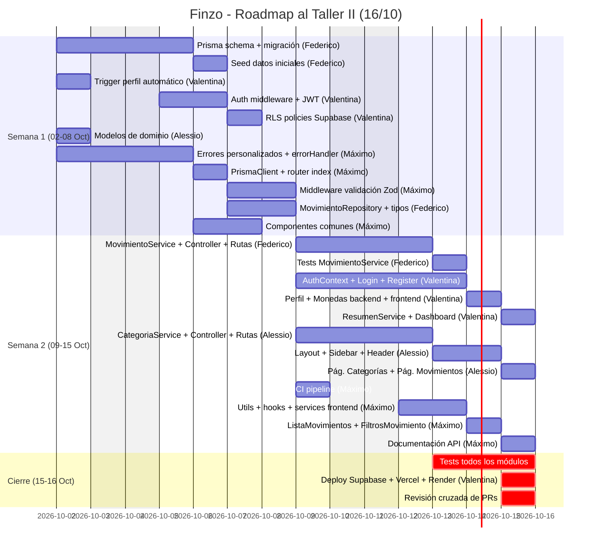

# 📋 Distribución de Tareas — Finzo (Taller II: 16/10/2026)

**Fecha de elaboración:** 02/10/2026  
**Deadline:** 16/10/2026 (14 días)  
**Foco del Taller II:** Diseño, patrones justificados, SOLID, refactoring y mantenibilidad.

---

## 📊 Estado Actual del Proyecto

La **Etapa 1 (fundación)** está completada: el monorepo está configurado, las dependencias instaladas, los servicios base integrados y la documentación lista. El proyecto tiene la estructura de carpetas armada pero **todo el código funcional del MVP está pendiente**: no existe aún ningún controller, service, repository, ruta ni modelo implementado.

A partir de ahora arranca la **Etapa 2 (MVP)**, que es la más pesada en volumen de código. El Taller II no exige tener el MVP completo, pero sí demostrar un **avance sólido** con diseño justificado, patrones aplicados y código que evidencie calidad.

---

## 🎯 Avance Esperado para el Taller II (16/10)

El Taller II evalúa **diseño, patrones justificados, SOLID, refactoring y mantenibilidad**. No es necesario tener todo terminado, pero sí mostrar progreso real y decisiones técnicas defendibles. Estas son las metas de avance:

1. **Prisma schema migrado** y seed funcional
2. **Autenticación** avanzada o completa (registro, login, logout) con Supabase Auth
3. **CRUD de Movimientos**: al menos el backend completo y frontend en progreso
4. **CRUD de Categorías**: al menos el backend completo y frontend en progreso
5. **Perfil y Monedas**: backend funcionando
6. **Dashboard**: al menos la estructura y conexión con el resumen
7. **Patrones claros y justificables**: Repository, capas Controller→Service→Repository, validación con Zod — esto es lo más importante para la defensa
8. **Primeros tests unitarios y de servicios** que evidencien SOLID y refactoring
9. **CI pipeline**: al menos configurado
10. **Deploy**: al menos un entorno funcional (Vercel o Render)

> [!NOTE]
> El MVP completo se cierra entre el Taller II y el Taller III (27/11). Lo que importa el 16/10 es que el equipo pueda **mostrar código real con arquitectura limpia y justificar las decisiones tomadas**, no que todo esté terminado.

---

## 👥 Distribución por Integrante (Full-Stack)

> [!NOTE]
> Cada integrante trabaja el flujo **completo** de su módulo: tipos/modelos → repository → service → controller → ruta → page/componentes frontend → tests. Esto garantiza que todos dominen la arquitectura y puedan defenderla en el Taller II.

> [!IMPORTANT]
> **Convención de nombres:** Todo el dominio se nombra en **español** según lo definido en la documentación del proyecto: `movimiento`, `categoria`, `perfil`, `moneda`, `resumen`. Los nombres de archivos, clases, servicios, repositorios y componentes deben respetar esta convención.

---

### 🔵 Federico Heinrich — Módulo: Prisma Schema + Backend Movimientos

**Rol temático:** Modelado de datos + backend del flujo CRUD principal.

Federico diseñó el modelo de datos del proyecto, por lo que se encarga de traducirlo al Prisma schema y de implementar el backend de movimientos, que es la entidad más compleja del sistema. Como ya tiene dominio sobre la infraestructura del proyecto, se enfoca en esta etapa en profundizar el lado de persistencia y negocio.

#### Persistencia (Prisma)

| #   | Tarea                                                                                                                                                                   | Archivos a crear/editar        | Peso     |
| --- | ----------------------------------------------------------------------------------------------------------------------------------------------------------------------- | ------------------------------ | -------- |
| 1   | Crear **Prisma schema** completo (`schema.prisma` con todas las tablas: monedas, perfiles, perfiles_monedas, categorias, movimientos) basado en el diagrama ER diseñado | `backend/prisma/schema.prisma` | 🔴 Alto  |
| 2   | Ejecutar primera migración y validar contra Supabase                                                                                                                    | (comando `prisma migrate dev`) | 🟡 Medio |
| 3   | Crear **seed** de datos iniciales (monedas base, categorías predeterminadas, datos de prueba)                                                                           | `backend/prisma/seed.ts`       | 🟡 Medio |

#### Backend

| #   | Tarea                                                                                                                                 | Archivos a crear/editar                             | Peso     |
| --- | ------------------------------------------------------------------------------------------------------------------------------------- | --------------------------------------------------- | -------- |
| 4   | Definir tipos/DTOs de Movimientos                                                                                                     | `backend/src/types/movimiento.types.ts`             | 🟢 Bajo  |
| 5   | Crear `MovimientoRepository` con Prisma (CRUD + filtros)                                                                              | `backend/src/repositories/movimiento.repository.ts` | 🟡 Medio |
| 6   | Crear `MovimientoService` con reglas de negocio (validar monto>0, tipo, medio de pago, categoría compatible, autorización por perfil) | `backend/src/services/movimiento.service.ts`        | 🔴 Alto  |
| 7   | Crear `MovimientoController` (parsear req, delegar al service, formatear response)                                                    | `backend/src/controllers/movimiento.controller.ts`  | 🟡 Medio |
| 8   | Definir rutas REST de movimientos (`GET`, `POST`, `PATCH`, `DELETE`)                                                                  | `backend/src/routes/movimiento.routes.ts`           | 🟢 Bajo  |
| 9   | Crear schema Zod de validación de entrada para movimientos                                                                            | `backend/src/types/schemas/movimiento.schema.ts`    | 🟡 Medio |
| 10  | Registrar rutas de movimientos en `app.ts`                                                                                            | `backend/src/app.ts`                                | 🟢 Bajo  |

#### Tests

| #   | Tarea                                                                                         | Archivos                                        | Peso     |
| --- | --------------------------------------------------------------------------------------------- | ----------------------------------------------- | -------- |
| 11  | Tests unitarios del `MovimientoService` (monto>0, tipo inválido, medio de pago, autorización) | `backend/tests/unit/movimiento.service.test.ts` | 🟡 Medio |

---

### 🟣 Valentina Vitale — Módulo: Autenticación + Perfil + Monedas + Resumen + Dashboard + Deploys

**Rol temático:** Seguridad transversal + gestión de identidad + resumen financiero + vista principal + infraestructura de deploy.

Valentina es la creadora del repositorio y de la instancia de Supabase, por lo que es natural que administre las plataformas de deploy y la capa de autenticación. Además, se encarga del Dashboard que consume los datos del resumen financiero, cerrando el flujo de punta a punta.

#### Backend

| #   | Tarea                                                                                            | Archivos a crear/editar                                                                                                                   | Peso     |
| --- | ------------------------------------------------------------------------------------------------ | ----------------------------------------------------------------------------------------------------------------------------------------- | -------- |
| 1   | Crear **trigger PostgreSQL** para crear perfil automático al registrarse en `auth.users`         | SQL directo en Supabase Dashboard                                                                                                         | 🟡 Medio |
| 2   | Crear middleware `auth.middleware.ts` (validar JWT de Supabase, extraer userId, inyectar en req) | `backend/src/middlewares/auth.middleware.ts`                                                                                              | 🔴 Alto  |
| 3   | Crear tipos/DTOs de Perfil y Monedas                                                             | `backend/src/types/perfil.types.ts`, `backend/src/types/moneda.types.ts`                                                                  | 🟢 Bajo  |
| 4   | Crear `PerfilRepository` + `PerfilService` + `PerfilController`                                  | `backend/src/repositories/perfil.repository.ts`, `backend/src/services/perfil.service.ts`, `backend/src/controllers/perfil.controller.ts` | 🟡 Medio |
| 5   | Crear `MonedaRepository` + `MonedaService` + `MonedaController` (catálogo + asignación a perfil) | `backend/src/repositories/moneda.repository.ts`, `backend/src/services/moneda.service.ts`, `backend/src/controllers/moneda.controller.ts` | 🟡 Medio |
| 6   | Definir rutas: `GET/PATCH /perfil`, `GET /monedas`, `GET/POST/DELETE /perfil/monedas`            | `backend/src/routes/perfil.routes.ts`, `backend/src/routes/moneda.routes.ts`                                                              | 🟢 Bajo  |
| 7   | Crear `ResumenService` (ingresos, gastos y balance del mes actual)                               | `backend/src/services/resumen.service.ts`                                                                                                 | 🟡 Medio |
| 8   | Crear `ResumenController` + ruta `GET /resumen`                                                  | `backend/src/controllers/resumen.controller.ts`, `backend/src/routes/resumen.routes.ts`                                                   | 🟢 Bajo  |
| 9   | Registrar rutas de perfil, monedas y resumen en `app.ts`                                         | `backend/src/app.ts`                                                                                                                      | 🟢 Bajo  |

#### Frontend

| #   | Tarea                                                                                              | Archivos a crear/editar                                                   | Peso     |
| --- | -------------------------------------------------------------------------------------------------- | ------------------------------------------------------------------------- | -------- |
| 10  | Crear `AuthContext` (estado de sesión, login, register, logout, onAuthStateChange)                 | `frontend/src/context/AuthContext.tsx`                                    | 🔴 Alto  |
| 11  | Implementar página de **Login**                                                                    | `frontend/src/pages/auth/Login.tsx`                                       | 🟡 Medio |
| 12  | Implementar página de **Register**                                                                 | `frontend/src/pages/auth/Register.tsx`                                    | 🟡 Medio |
| 13  | Crear rutas protegidas y públicas (`RutaProtegida`, `RutaPublica`)                                 | `frontend/src/routes/AppRouter.tsx`                                       | 🟡 Medio |
| 14  | Implementar página de **Perfil** (editar nombre, apellido, monedas)                                | `frontend/src/pages/Perfil.tsx`                                           | 🟡 Medio |
| 15  | Crear `apiClient` HTTP base (interceptor para JWT, base URL)                                       | `frontend/src/services/api.ts`                                            | 🟡 Medio |
| 16  | Crear `resumenService` (llamada a `GET /resumen`)                                                  | `frontend/src/services/resumen.service.ts`                                | 🟢 Bajo  |
| 17  | Implementar **Dashboard**: tarjetas de resumen (ingresos, gastos, balance) + movimientos recientes | `frontend/src/pages/Dashboard.tsx`, `frontend/src/components/dashboard/*` | 🔴 Alto  |

#### Deploy e Infraestructura (3 plataformas)

| #   | Tarea                                                                             | Plataforma                 | Peso     |
| --- | --------------------------------------------------------------------------------- | -------------------------- | -------- |
| 18  | Configurar **RLS policies** (Row Level Security) para aislar datos por usuario    | ☁️ Supabase                | 🟡 Medio |
| 19  | Configurar **Storage policies** si se usa foto de perfil                          | ☁️ Supabase                | 🟢 Bajo  |
| 20  | Verificar configuración de **Auth providers** (email/password) y URLs de redirect | ☁️ Supabase                | 🟢 Bajo  |
| 21  | Configurar proyecto frontend en **Vercel** (build command, env vars, dominio)     | 🔺 Vercel                  | 🟡 Medio |
| 22  | Configurar Web Service del backend en **Render** (build, start, env vars)         | 🟩 Render                  | 🟡 Medio |
| 23  | Configurar variables de entorno de producción en las 3 plataformas                | Supabase + Vercel + Render | 🟢 Bajo  |

#### Tests y Calidad

| #   | Tarea                                                          | Archivos                                     | Peso     |
| --- | -------------------------------------------------------------- | -------------------------------------------- | -------- |
| 24  | Tests del `auth.middleware` (token válido, inválido, expirado) | `backend/tests/unit/auth.middleware.test.ts` | 🟡 Medio |
| 25  | Tests del `PerfilService` (autorización, edición)              | `backend/tests/unit/perfil.service.test.ts`  | 🟡 Medio |
| 26  | Tests del `ResumenService` (cálculo de balance)                | `backend/tests/unit/resumen.service.test.ts` | 🟡 Medio |

---

### 🟠 Alessio Cragno — Módulo: Categorías + Layout + Página de Movimientos

**Rol temático:** CRUD de categorías end-to-end + shell visual de la app + página de Movimientos del frontend.

Alessio se encarga del layout general que todos los demás van a usar (Sidebar, Header, PageContainer), del CRUD completo de categorías, y de armar la página de Movimientos que consume el backend que implementa Federico. Esto le da un panorama amplio del frontend y contacto directo con la lógica de negocio en backend.

#### Backend

| #   | Tarea                                                                                                                                              | Archivos a crear/editar                                                                                                                                       | Peso     |
| --- | -------------------------------------------------------------------------------------------------------------------------------------------------- | ------------------------------------------------------------------------------------------------------------------------------------------------------------- | -------- |
| 1   | Definir tipos/DTOs de Categorías                                                                                                                   | `backend/src/types/categoria.types.ts`                                                                                                                        | 🟢 Bajo  |
| 2   | Crear `CategoriaRepository` con Prisma (CRUD, separación predeterminadas vs personalizadas)                                                        | `backend/src/repositories/categoria.repository.ts`                                                                                                            | 🟡 Medio |
| 3   | Crear `CategoriaService` (reglas: máx 8 personalizadas, no editar predeterminadas, tipo ingreso/gasto, estrategia de borrado si tiene movimientos) | `backend/src/services/categoria.service.ts`                                                                                                                   | 🔴 Alto  |
| 4   | Crear `CategoriaController`                                                                                                                        | `backend/src/controllers/categoria.controller.ts`                                                                                                             | 🟡 Medio |
| 5   | Definir rutas REST de categorías (`GET`, `POST`, `PATCH`, `DELETE`)                                                                                | `backend/src/routes/categoria.routes.ts`                                                                                                                      | 🟢 Bajo  |
| 6   | Registrar rutas de categorías en `app.ts`                                                                                                          | `backend/src/app.ts`                                                                                                                                          | 🟢 Bajo  |
| 7   | Crear modelos de dominio compartidos (interfaces de entidades)                                                                                     | `backend/src/models/perfil.model.ts`, `backend/src/models/movimiento.model.ts`, `backend/src/models/categoria.model.ts`, `backend/src/models/moneda.model.ts` | 🟡 Medio |

#### Frontend

| #   | Tarea                                                                               | Archivos a crear/editar                                                           | Peso     |
| --- | ----------------------------------------------------------------------------------- | --------------------------------------------------------------------------------- | -------- |
| 8   | Crear tipos compartidos de Categorías y Movimientos                                 | `frontend/src/types/categoria.types.ts`, `frontend/src/types/movimiento.types.ts` | 🟢 Bajo  |
| 9   | Crear `categoriaService` (llamadas HTTP al backend)                                 | `frontend/src/services/categoria.service.ts`                                      | 🟡 Medio |
| 10  | Crear hook `useCategorias`                                                          | `frontend/src/hooks/useCategorias.ts`                                             | 🟡 Medio |
| 11  | Página de **Categorías** (listado con chips de color, formulario de crear/editar)   | `frontend/src/pages/Categorias.tsx`                                               | 🔴 Alto  |
| 12  | Componentes: `ListaCategorias`, `FormularioCategoria`, `EtiquetaCategoria`          | `frontend/src/components/categories/*`                                            | 🟡 Medio |
| 13  | Implementar **Sidebar** con navegación (Dashboard, Movimientos, Categorías, Perfil) | `frontend/src/components/layout/Sidebar.tsx`                                      | 🟡 Medio |
| 14  | Implementar **Header** (logo, nombre de usuario, botón logout)                      | `frontend/src/components/layout/Header.tsx`                                       | 🟡 Medio |
| 15  | Implementar **PageContainer** (layout principal con sidebar + header + contenido)   | `frontend/src/components/layout/PageContainer.tsx`                                | 🟡 Medio |
| 16  | Implementar **Navbar** (navegación responsive para mobile)                          | `frontend/src/components/layout/Navbar.tsx`                                       | 🟡 Medio |
| 17  | Página de **Movimientos** (listado con filtros + formulario modal de crear/editar)  | `frontend/src/pages/Movimientos.tsx`                                              | 🔴 Alto  |
| 18  | Componente `FormularioMovimiento` (formulario de creación y edición de movimiento)  | `frontend/src/components/transactions/FormularioMovimiento.tsx`                   | 🟡 Medio |

#### Tests y Calidad

| #   | Tarea                                                                                     | Archivos                                             | Peso     |
| --- | ----------------------------------------------------------------------------------------- | ---------------------------------------------------- | -------- |
| 19  | Tests unitarios del `CategoriaService` (máx 8, no borrar predeterminada, tipo compatible) | `backend/tests/unit/categoria.service.test.ts`       | 🟡 Medio |
| 20  | Tests de integración de endpoints de categorías                                           | `backend/tests/integration/categoria.routes.test.ts` | 🟡 Medio |

---

### 🟢 Máximo Messina — Módulo: Errores + Validación + CI + Utils + Componentes de Movimientos

**Rol temático:** Infraestructura de calidad, pipeline CI, utilidades compartidas, documentación de API + componentes frontend de movimientos.

Máximo construye las piezas transversales que todo el equipo consume (errores, validación, utilidades, componentes comunes, CI). Además se encarga de la parte frontend de movimientos que complementa el trabajo de Alessio (página) y Federico (backend): los componentes de listado, filtros, hooks y el service HTTP.

#### Backend

| #   | Tarea                                                                                                                                    | Archivos a crear/editar                                                                       | Peso     |
| --- | ---------------------------------------------------------------------------------------------------------------------------------------- | --------------------------------------------------------------------------------------------- | -------- |
| 1   | Crear sistema de **errores personalizados** (`AppError`, `ErrorNoEncontrado`, `ErrorProhibido`, `ErrorDeValidacion`, `ErrorDeConflicto`) | `backend/src/utils/errores.ts`                                                                | 🟡 Medio |
| 2   | Refactorizar `errorHandler` para manejar errores personalizados con códigos HTTP correctos (400, 401, 403, 404, 409, 500)                | `backend/src/middlewares/errorHandler.ts`                                                     | 🟡 Medio |
| 3   | Crear utilidades de backend: formateo de montos, cálculos de fechas para filtros por mes/año, parseo de query params                     | `backend/src/utils/formato.ts`, `backend/src/utils/fecha.ts`, `backend/src/utils/consulta.ts` | 🟡 Medio |
| 4   | Crear **middleware de validación** con Zod reutilizable (`validarCuerpo`, `validarParametros`, `validarQuery`)                           | `backend/src/middlewares/validacion.middleware.ts`                                            | 🔴 Alto  |
| 5   | Crear schemas Zod reutilizables para cada entidad (categoría, perfil, moneda)                                                            | `backend/src/types/schemas/` (`categoria.schema.ts`, `perfil.schema.ts`)                      | 🟡 Medio |
| 6   | Crear `PrismaClient` singleton configurado                                                                                               | `backend/src/config/prisma.ts`                                                                | 🟢 Bajo  |
| 7   | Definir el **router index** que agrupa todas las rutas bajo `/api`                                                                       | `backend/src/routes/index.ts`                                                                 | 🟢 Bajo  |

#### Frontend

| #   | Tarea                                                                                                                                     | Archivos a crear/editar                                                                                                   | Peso     |
| --- | ----------------------------------------------------------------------------------------------------------------------------------------- | ------------------------------------------------------------------------------------------------------------------------- | -------- |
| 8   | Crear utilidades de frontend: formateo de moneda, formateo de fecha, cálculos de porcentajes                                              | `frontend/src/utils/moneda.ts`, `frontend/src/utils/fecha.ts`, `frontend/src/utils/formato.ts`                            | 🟡 Medio |
| 9   | Crear tipos compartidos base (respuestas de API, errores, paginación)                                                                     | `frontend/src/types/api.types.ts`, `frontend/src/types/comunes.types.ts`                                                  | 🟡 Medio |
| 10  | Crear hook `useApi` genérico (loading, error, data, refetch)                                                                              | `frontend/src/hooks/useApi.ts`                                                                                            | 🟡 Medio |
| 11  | Implementar **manejo global de errores** en el frontend (toast/notificaciones)                                                            | `frontend/src/components/common/Notificacion.tsx`, `frontend/src/hooks/useNotificacion.ts`                                | 🟡 Medio |
| 12  | Crear `perfilService` y `monedaService` HTTP                                                                                              | `frontend/src/services/perfil.service.ts`, `frontend/src/services/moneda.service.ts`                                      | 🟡 Medio |
| 13  | Crear `movimientoService` (llamadas HTTP al backend: CRUD + filtros)                                                                      | `frontend/src/services/movimiento.service.ts`                                                                             | 🟡 Medio |
| 14  | Crear hook `useMovimientos` (estado, loading, error, CRUD)                                                                                | `frontend/src/hooks/useMovimientos.ts`                                                                                    | 🟡 Medio |
| 15  | Componentes: `ListaMovimientos`, `FiltrosMovimiento`                                                                                      | `frontend/src/components/transactions/ListaMovimientos.tsx`, `frontend/src/components/transactions/FiltrosMovimiento.tsx` | 🟡 Medio |
| 16  | Crear componentes comunes reutilizables: `Boton`, `InputTexto`, `Modal`, `Tarjeta`, `Selector`, `Cargando`, `EstadoVacio`, `MensajeError` | `frontend/src/components/common/*`                                                                                        | 🔴 Alto  |

#### CI/CD y Documentación

| #   | Tarea                                                                              | Archivos                   | Peso    |
| --- | ---------------------------------------------------------------------------------- | -------------------------- | ------- |
| 17  | Configurar **GitHub Actions** workflow de CI (lint, typecheck, tests, build)       | `.github/workflows/ci.yml` | 🔴 Alto |
| 18  | Configurar protección de ramas (`main`, `develop`)                                 | GitHub Settings            | 🟢 Bajo |
| 19  | Documentar la **API** completa en `docs/API.md` (rutas, request/response, errores) | `docs/API.md`              | 🔴 Alto |

#### Tests y Calidad

| #   | Tarea                                                                                    | Archivos                                           | Peso     |
| --- | ---------------------------------------------------------------------------------------- | -------------------------------------------------- | -------- |
| 20  | Tests unitarios de utilidades (formateo de montos, cálculos de fecha, parseo de queries) | `backend/tests/unit/utilidades.test.ts`            | 🟡 Medio |
| 21  | Tests del `errorHandler` (cada tipo de error → código HTTP correcto)                     | `backend/tests/unit/errorHandler.test.ts`          | 🟡 Medio |
| 22  | Tests del middleware de validación Zod                                                   | `backend/tests/unit/validacion.middleware.test.ts` | 🟡 Medio |
| 23  | Tests de componentes comunes en frontend (formularios, estados de carga/error)           | `frontend/src/App.test.tsx` y nuevos tests         | 🟡 Medio |

---

## 📐 Justificación de Patrones y SOLID (para la defensa)

Cada integrante debe poder explicar al menos estas aplicaciones en su módulo:

| Principio / Patrón                  | Dónde se evidencia                                                      | Quién lo defiende          |
| ----------------------------------- | ----------------------------------------------------------------------- | -------------------------- |
| **SRP** (Responsabilidad Única)     | Controller (HTTP) ≠ Service (negocio) ≠ Repository (datos)              | Todos                      |
| **OCP** (Abierto/Cerrado)           | Middleware de validación genérico reutilizable sin modificar            | Máximo                     |
| **DIP** (Inversión de Dependencias) | Services dependen de interfaces de Repository, no de Prisma directo     | Federico, Alessio          |
| **Repository Pattern**              | Aislamiento de Prisma en capa de repositorios                           | Todos (cada uno su módulo) |
| **Strategy**                        | Diferentes cálculos de resumen (mensual, por categoría) intercambiables | Valentina                  |
| **Factory**                         | Errores personalizados con constructores tipados                        | Máximo                     |
| **Middleware Chain**                | Auth → Validación → Controller (Express pipeline)                       | Valentina, Máximo          |
| **Refactoring documentado**         | errorHandler antes/después, separación de capas antes/después           | Máximo, Todos              |

---

## 🗓️ Cronograma Sugerido (14 días)



---

## 📊 Resumen de Carga por Integrante

| Integrante    |                   Backend                   |                                  Frontend                                   |  Tests   |             Infra/CI/Docs              |
| :------------ | :-----------------------------------------: | :-------------------------------------------------------------------------: | :------: | :------------------------------------: |
| **Federico**  |     Prisma schema + seed + Movimientos      |                                      —                                      | 1 suite  |                   —                    |
| **Valentina** |      Auth + Perfil + Monedas + Resumen      |                    Login + Register + Perfil + Dashboard                    | 3 suites | Deploy ×3 (Supabase + Vercel + Render) |
| **Alessio**   |        Categorías + Modelos dominio         | Layout completo + Pág. Categorías + Pág. Movimientos + FormularioMovimiento | 2 suites |                   —                    |
| **Máximo**    | Errores + Validación + Utils + PrismaClient |      Comunes + ListaMovimientos + FiltrosMovimiento + hooks + services      | 4 suites |              CI + API.md               |

---

## ⚡ Dependencias Críticas (Orden de Ejecución)

```
1. Federico: Prisma schema + migración + seed → BLOQUEA a todos (repositorios necesitan el schema)
2. Valentina: Auth middleware → BLOQUEA endpoints protegidos
3. Máximo: Errores + errorHandler + PrismaClient → BLOQUEA controllers
4. Máximo: Middleware de validación Zod → BLOQUEA controllers
5. Máximo: Componentes comunes → BLOQUEA páginas
6. Alessio: Modelos de dominio → útil para todos (no bloqueante)
7. Valentina: AuthContext → BLOQUEA frontend protegido
8. Alessio: Layout (Sidebar, Header, PageContainer) → BLOQUEA navegación
```

> [!WARNING]
> **Los primeros 3-4 días son críticos.** Federico debe sacar el Prisma schema + migración lo antes posible (es la pieza que desbloquea a todos). En paralelo, Valentina trabaja en el auth middleware y Máximo en los errores, validación y componentes comunes. Solo cuando estas piezas estén listas, los controllers y las páginas pueden integrarse de punta a punta.

---

## 🤝 Responsabilidades Compartidas por Todos

- Revisar al menos **2 PRs** de compañeros
- Escribir tests de su propio módulo
- Documentar cualquier decisión de diseño o refactoring
- Conocer el flujo completo: usuario → frontend → API → service → repository → DB
- Poder explicar al menos 2 principios SOLID aplicados en su código
